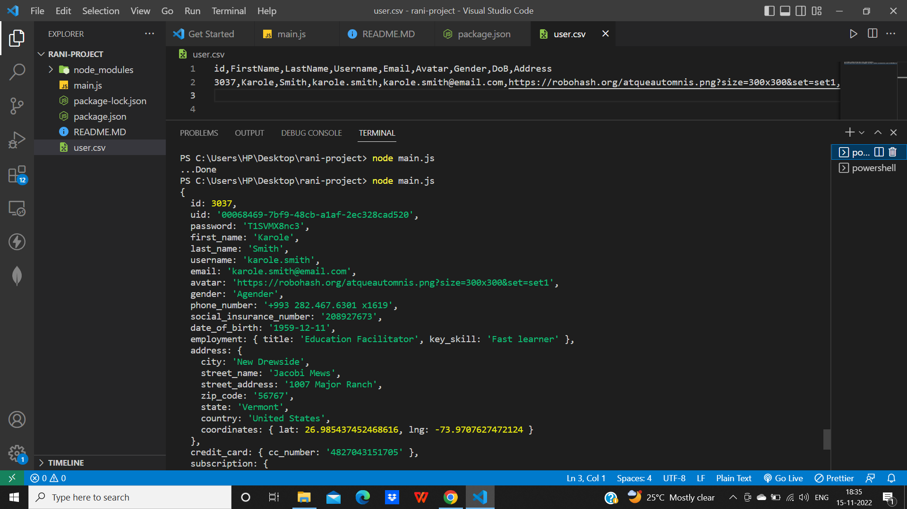

# Prerequisite

1.  Must have basic knowledge of **Node**, **Express**.

# Install Dependencies

**For Backend** - `npm i`

### `npm start`

to get a output start a command :- `node main.js`

### Output:-

